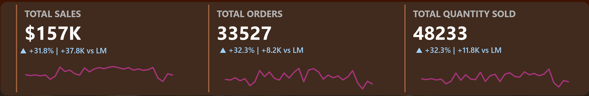
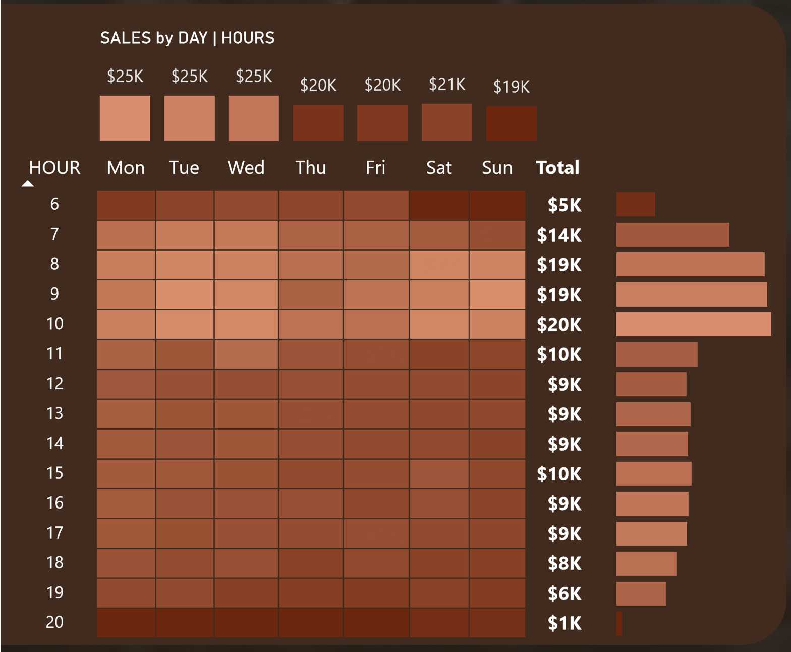
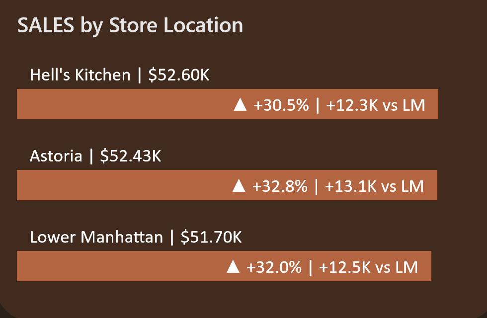

#  Coffee Shop Sales Analysis – Detailed Case Study

## 🔎 Problem
The coffee shop struggled to understand sales across time, products, and locations. Goals: identify top items, pinpoint peak days/hours, and inform targeted operational decisions.

## 📊 Data
- Source: `Coffee Shop Sales.csv` (~140k+ entries — large enough for reliable analysis)
- Key fields: date-time, product category, location, quantity, sales, order ID.

## 🛠 Approach
1. Data cleaning & transformation via MySQL.
2. KPI computations: Total Sales, Total Orders, Average Quantity, MoM growth.
3. Trends by day/weekend, hours, locations, product categories.
4. Dashboard visualized in Power BI — interactive narrative.

## 📸 Visuals

**1. KPI Overview**  
Shows total sales, transactions, and quantity trends.

Provides an at-a-glance summary of business performance.

**2. Sales by Hour & Day/Weekend**  
Analyzes customer activity across weekdays and hours.

Helps identify the busiest time slots.

**3. Top Products & Locations**  
Compares revenue across different coffee shop locations.

Useful for business strategy and resource allocation.

**4. Top 10 Best-Selling Products
A bar chart ranking the top 10 products by total sales. This visualization highlights customer favorites and helps identify which items drive the highest revenue.

## 🔑 Key Insights
- Peak sales occur between X–Y hr; weekends outpace weekdays by Z%.
- Top product categories: A, B, C — with A driving Q% of total revenue.
- Location L3 consistently outperforming others in both orders and unit value.

## 🏁 Business Actions
- Staff push/promotions during peak hours to capitalize on high traffic.
- Spotlight and upsell top categories via loyalty or bundling.
- Explore what's working at top location (store layout, marketing) and replicate across other stores.

