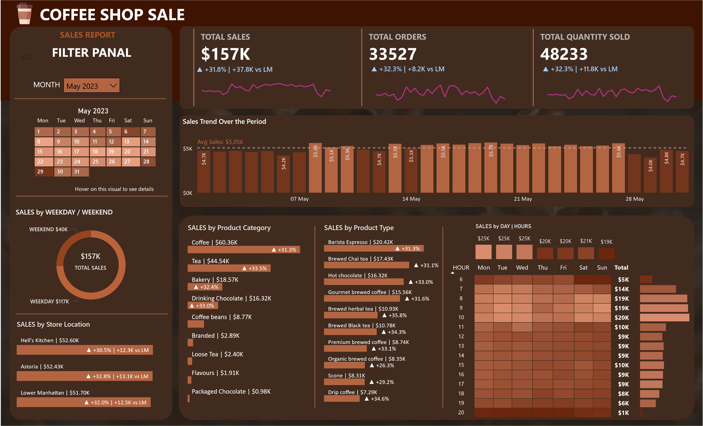

# ​ ☕Coffee Shop Sales Analysis (MySQL + Power BI Project)

  
  
  
  

---

## 📊 Dashboard Preview

---

## 📌 Overview
An end-to-end analytics project analyzing a coffee shop chain's sales trends using a dataset of over **140,000 rows**.  
Includes: problem statement, SQL analysis, and interactive Power BI dashboard.

---

## 📂 Project Files
- `coffee shop query.sql` → SQL queries  
- `Coffee Shop Sales.csv` → Dataset (~140k+ rows)  
- `MY SQL Queries.docx` → Query docs  
- `Coffee Shop Dashboard.pbix` → Power BI dashboard  
- `Coffee Shop Problem.pptx` → Problem statement (requirements)

---

### ➕ Extras
- `extras/CoffeeShopSales.xlsx` → Optional Excel version (formatted/pivots)

---

## 🚀 How to Run
1. Review the business problem (`Coffee Shop Problem.pptx`)  
2. Load `Coffee Shop Sales.csv` into MySQL  
3. Run SQL queries from `coffee shop query.sql`  
4. Review documentation (`MY SQL Queries.docx`)  
5. Open the Power BI dashboard (`.pbix`) to explore visuals

---

## 🎯 Business Goals
- Define the business problem
- Calculate KPIs: total sales, orders, quantity  
- Analyze MoM growth  
- Explore trends by hour, day vs. weekend, location, product category, top products

---

## 📄​ Detailed Case Study
For the full structured case study → [View Here](CASE_STUDY.md)

---

## ⚙️ Tech Stack
- MySQL, Power BI, PowerPoint, large CSV (~140k+ rows), detailed documentation

---

## 📊 Key Insights
- Clear problem framing  
- Handled high-volume data effectively  
- Identified key patterns (weekday/weekend, top items, peak hours)  
- Delivered the story via interactive dashboard

---

✨ *This project showcases the full analytics pipeline—from business problem to presentation-ready insights.*
